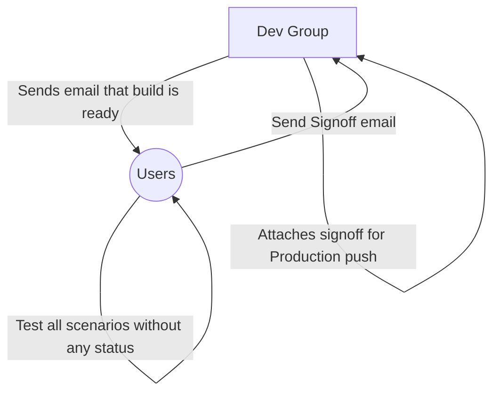
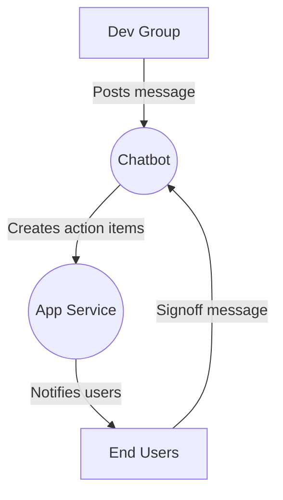

## StampBOT - Audit Tracker BOT

### About

In an agile scenario, Release Management is a pain where multiple parties are involved including Dev, BAs and End-Users.<br/> 
Here is a small illustration of the events which take place on usual iteration/sprint.


### Issues with the above model : 
* Dev and BA's are working in Silos.
* No visibility of the state of the email sent.
* Release work often gets in the middle of sprint work and developers have to own the whole process.
* No single point of tracking mechanism.
* Need to dig through the email to figure out whole process.

### Solution workflow



```mermaid
 graph LR
        od>In-app Bot] -.-> Chatbot engine
        di{Diamond with <br/> line break} -.-> ro(Rounded<br>square<br>shape)
        di==>ro2(Rounded square shape)
 end
```

### Main Components
1. Workflow API - To track user conversation states [Answered, Unanswered, Error, In progress] allowing it to locate users based on their streamId.
2. Audit API    - To log & query the incoming data to a persistent store
3. Lang API     - API to support NLP semantics and conversation 
4. Service API  - Listener & Responder for incoming chats to the bot.
