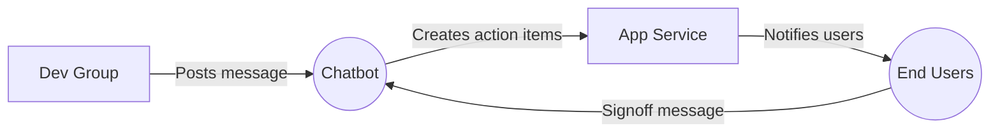

## Auditing for release management.

```mermaid
graph LR
    Developer[Dev Group] -- Posts message --> B((Chatbot))
    B((Chatbot)) -- Creates action items --> App[App Service]
    App[App Service] -- Notifies users --> E((End Users))
    E((End Users)) -- Signoff message --> B((Chatbot))
    
```
***

When the `Developer` posts a message `with Jira Items mentioning users in the room` it.